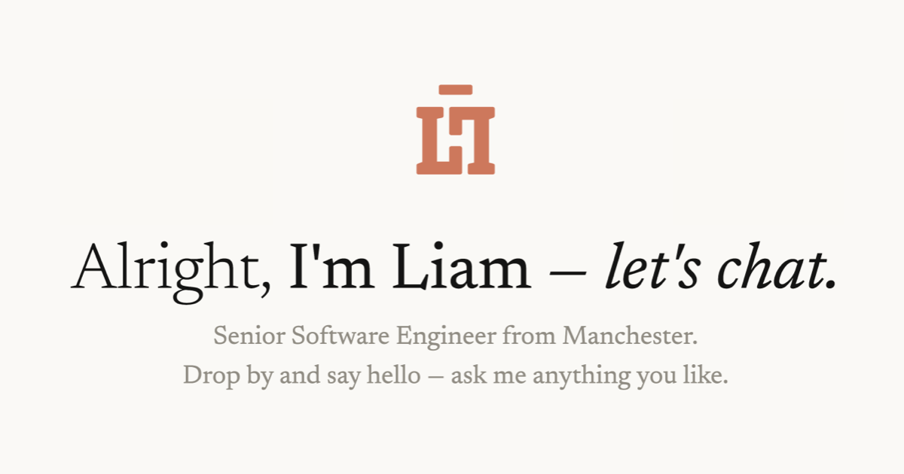

# Liam Hales — Official Website

The official website for Liam Hales. A place to demonstrate skills, experience and projects through an AI chat interface.

https://liamhales.dev

<br/>
<br/>

# Local Development 👨🏻‍💻

To get up and running with local development you must follow all the steps in the below sections.

> ⚠️ _**WARNING** —  You must be running macOS or Linux_

## Install Node.js

Follow the steps below to install Node.js using [`nvm`] (Node Version Manager)

1. Download and install [`nvm`]
2. Install and use Node.js `>= v24.18`

```sh
$ nvm install 24.18
$ nvm use 24.18
```

3. Verify you are running a version of Node.js `>= v24.18`

```sh
$ node --version
v24.18.0

$ npm --version
v11.16.0
```

Check out their official [installation guide](https://nodejs.org/en/download) for more info.

## Install Dependencies

1. Run `corepack enable` to enable [Corepack]
2. You should now be able to use the [`yarn`] package manager which you **MUST** use for this project

> 📝 _**NOTE** — Yarn comes bundled with [Corepack] and is the preferred way to install/manage Yarn. Check out their official [installation guide](https://yarnpkg.com/getting-started/install) for more info_

```sh
$ yarn --version
v4.17.0
```

> 📝 _**NOTE** — The current version of Yarn should match the `packageManager` version in the [`package.json`](/package.json)_

3. Run `yarn` in the project root to install dependencies

## Setup Environment

Create a `.env` file in the project root

```sh
SITE_URL = 'https://liamhales.dev'

GITHUB_ACCESS_TOKEN = 'github_pat_1234'

AWS_REGION = 'eu-west-2'
AWS_ACCESS_KEY_ID = 'aws-access-key-id'
AWS_SECRET_ACCESS_KEY = 'aws-secret-access-key'
```

## Start App 🚀

For local development there are two ways to build and start the app depending on your specific needs.

- [Development Build](#development-server) — Should be used when developing the app
- [Production Build](#production-server) — Should be used to simulate how the app will run in production

### Development Build

- Run `yarn start:dev` to start the development server

```sh
$ yarn start:dev
```

### Production Build

1. Run `yarn build` to build the app for production
2. Run `yarn start:prod` to start the production server

```sh
$ yarn build
$ yarn start:prod
```

## Dependency Management 📦

Dependencies are managed using Yarn's built-in commands which display outdated packages and can upgrade them to a chosen version.

- Use `yarn up` to upgrade a specific dependency
- Use `yarn upgrade-interactive` to list outdated dependencies and upgrade multiple at once

Check out the [`yarn up`] and [`yarn upgrade-interactive`] docs or use the `--help` flag more info.

## Public Assets 🌆

Most public assets already exist in the `/public` directory, however some assets such as some of the icons are dynamically built using build scripts.

- Run `yarn build:icons` to build the `favicon.ico`, `.webp` and `.png` icons

```sh
$ yarn build:icons
```

> 📝 _**NOTE** — These public assets are not required for a functional build_

> 📝 _**NOTE** — Public assets such as the `sitemap.xml` and `robots.txt` files exists on dynamic routes_

[`nvm`]: https://github.com/nvm-sh/nvm
[`yarn`]: https://yarnpkg.com
[Corepack]: https://nodejs.org/api/corepack.html
[`yarn up`]: https://yarnpkg.com/cli/up
[`yarn upgrade-interactive`]: https://yarnpkg.com/cli/upgrade-interactive
